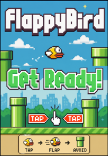

# Flappy Bird Clone

A Python-based Flappy Bird game clone built with Pygame.

## Screenshot



## Overview

This is a classic Flappy Bird gameplay implementation where you control a bird navigating through gaps in pipes. The goal is to survive as long as possible by avoiding collisions with the ground and pipes while passing through gaps.

## Project Structure

```
Flappy/
├── main.py              # Main game logic
├── gallery/
│   ├── sprites/         # Game visual assets
│   │   ├── bird.png    # Player sprite
│   │   ├── background.png
│   │   ├── pipe.png
│   │   ├── base.png
│   │   ├── message.png
│   │   └── 0-9.png     # Score digits
│   └── audio/           # Sound effects
│       ├── hit.wav
│       ├── die.wav
│       ├── point.wav
│       ├── swoosh.wav
│       └── wing.wav
└── README.md
```

## Requirements

- **Python 3.x**
- **Pygame** library

Install Pygame via pip:
```bash
pip install pygame
```

## How to Run

```bash
python main.py
```

## Controls

| Key             | Action    |
|-----------------|-----------|
| `SPACE` or `UP` | Flap/Jump |
| `ESC`           | Quit Game |
| Window Close    | Exit      |

## Game Features

- **Welcome Screen** — Animated start screen with bird and title
- **Physics-based Flight** — Gravity and flap mechanics
- **Random Pipe Generation** — Endless pipe obstacles with varying gaps
- **Score Tracking** — Real-time score display using sprite digits
- **Sound Effects** — Audio feedback for flapping, collisions, and scoring
- **Collision Detection** — Pixel-perfect hit detection for pipes and ground

## Game Mechanics

1. **Gravity** — Bird falls continuously due to gravity
2. **Flapping** — Pressing SPACE/UP applies upward velocity
3. **Pipe Movement** — Pipes scroll from right to left
4. **Scoring** — +1 point for each pipe pair passed
5. **Game Over** — Collision with pipe or ground ends the game

## Screen Dimensions

- Width: 289 pixels
- Height: 511 pixels
- Frame Rate: 32 FPS

